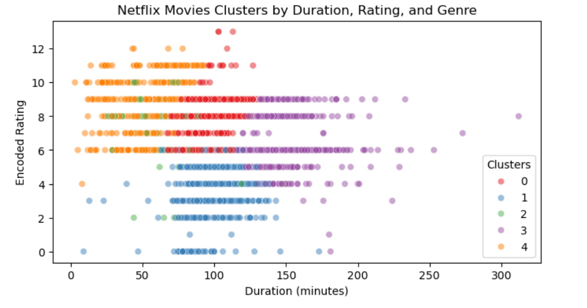
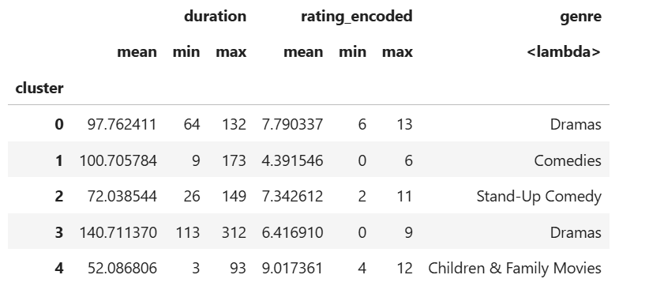

# Netflix Movies Clustering

## Project Description
This project explores clustering of Netflix movies based on their **duration, rating, and primary genre**. Using **KMeans clustering**, movies were grouped into 5 clusters to uncover patterns in content characteristics. The goal is to understand how movies differ by length, rating, and genre on Netflix.

## Dataset
- Source: [Netflix Titles Dataset](https://www.kaggle.com/datasets/shivamb/netflix-shows)
- Columns used:
  - `title` — Movie title
  - `type` — Movie or TV Show
  - `duration` — Duration of the movie (in minutes)
  - `rating` — Content rating (e.g., PG, R)
  - `listed_in` — Genres/categories
- Missing values were dropped for selected columns, and only movies were considered (no TV shows).

## Steps / Methodology

### 1. Preprocessing
- Filtered dataset to only include movies (`duration` containing 'min').
- Converted `duration` to integer (minutes).
- Extracted primary genre from `listed_in`.
- Encoded categorical variables:
  - `rating` to `rating_encoded` (LabelEncoder)
  - `genre` to `genre_encoded` (LabelEncoder)

### 2. Clustering
- Features used: `rating_encoded`, `duration`, `genre_encoded`.
- Standardised features using `StandardScaler`.
- Applied K-Means clustering with 5 clusters:
  ```python
  kmeans = KMeans(n_clusters=5, random_state=77)
  movies['cluster'] = kmeans.fit_predict(X_scaled)

  ## 📈 Results

### Scatter Plot (Clusters by Duration vs Rating)


This scatterplot shows the clusters of Netflix movies by **duration** (x-axis) and **encoded rating** (y-axis).  
- Each color represents one of the **5 clusters**.  
- We observe dense groupings around **shorter durations (50–120 min)** and mid-to-high ratings, while longer movies (over 150 min) form a separate cluster.  

---

### Cluster Summary Table


| Cluster | Avg. Duration | Avg. Rating (Encoded) | Dominant Genre              | Insights |
|---------|---------------|------------------------|-----------------------------|----------|
| **0**   | ~98 min       | ~7.8                  | Dramas                      | Standard-length dramas with strong ratings |
| **1**   | ~101 min      | ~4.4                  | Comedies                    | Comedies of varied length but generally lower ratings |
| **2**   | ~72 min       | ~7.3                  | Stand-Up Comedy             | Shorter content, moderate ratings, clustered tightly |
| **3**   | ~141 min      | ~6.4                  | Dramas                      | Long-duration dramas with slightly lower ratings |
| **4**   | ~52 min       | ~9.0                  | Children & Family Movies    | Shortest content with the **highest ratings** |

---

## 🔎 Analysis & Insights

1. **Dramas Split into Two Clusters**  
   - **Cluster 0**: Standard dramas (~100 min) with strong ratings.  
   - **Cluster 3**: Long dramas (~140+ min) that tend to receive lower ratings.  
   This suggests **movie length affects audience perception**.

2. **Comedies (Cluster 1)**  
   - Cover a wide range of durations but receive **lower ratings overall**.  
   - Indicates variability in comedic content but **less consistent audience reception**.

3. **Stand-Up Comedy (Cluster 2)**  
   - Shorter (~70 min), clustered tightly.  
   - Ratings are decent but not as high as family movies.  

4. **Children & Family Movies (Cluster 4)**  
   - **Shortest duration (~50 min)** but **highest average ratings**.  
   - Suggests shorter, family-friendly content performs well with audiences.  

